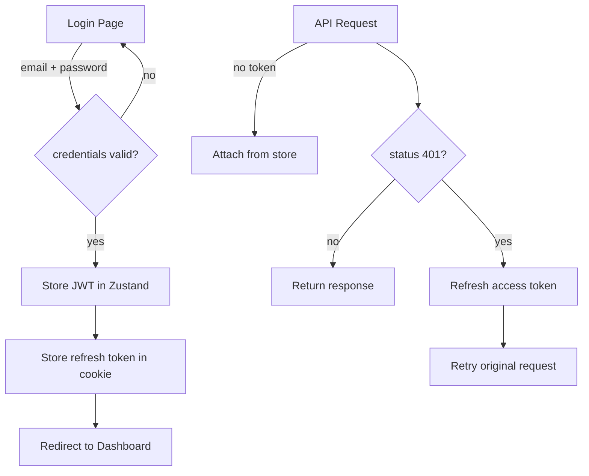

# Complete Next.js 14 Frontend Implementation Guide

## Overview

A production-ready Next.js 14 frontend for the Member Management System with TypeScript strict mode, React Query, Zustand, React Hook Form, shadcn/ui components, and comprehensive Thai language support.

## Technology Stack

| Layer | Technology | Version |
|-------|-----------|---------|
| Framework | Next.js 14 App Router | ^14.1.0 |
| Language | TypeScript | ^5.3.3 |
| Styling | Tailwind CSS | ^3.4.1 |
| UI Components | shadcn/ui | via @radix-ui |
| Server State | React Query (TanStack) | ^5.28.0 |
| Client State | Zustand | ^4.4.7 |
| Forms | React Hook Form | ^7.50.1 |
| Validation | Zod | ^3.22.4 |
| HTTP Client | Axios | ^1.6.5 |
| File Upload | React Dropzone | ^14.2.3 |
| Date Handling | date-fns | ^2.30.0 |
| Icons | Lucide React | ^0.376.0 |

## Project Structure

```
frontend/
├── app/                           # Next.js 14 App Router
│   ├── (auth)/                   # :// Authentication group
│   │   ├── layout.tsx            # Auth layout with gradient
│   │   ├── login/page.tsx        # Login form
│   │   ├── forgot-password/page.tsx
│   │   ├── verify-otp/page.tsx   # OTP verification with timer
│   │   └── reset-password/page.tsx
│   │
│   ├── (admin)/                  # :// Admin dashboard group
│   │   ├── layout.tsx            # Admin navbar with navigation
│   │   ├── dashboard/page.tsx    # Stats and recent activity
│   │   ├── members/
│   │   │   ├── page.tsx          # Searchable member list
│   │   │   ├── new/page.tsx      # Add new member form
│   │   │   └── [id]/page.tsx     # Member detail/edit page
│   │   ├── receipts/
│   │   │   ├── page.tsx          # Receipt list with filters
│   │   │   └── new/page.tsx      # Create receipt form
│   │   └── files/page.tsx        # File manager
│   │
│   ├── (member)/                 # :// Member portal group
│   │   ├── layout.tsx            # Member navbar
│   │   ├── profile/page.tsx      # View profile
│   │   ├── receipts/page.tsx     # Receipt history
│   │   └── upload-proof/page.tsx # Upload payment proof
│   │
│   ├── globals.css               # Global Tailwind styles
│   ├── layout.tsx                # Root layout with providers
│   └── page.tsx                  # Home page (redirect to login)
│
├── components/                    # Reusable components
│   ├── ui/                       # shadcn/ui components
│   │   ├── button.tsx
│   │   ├── card.tsx
│   │   ├── form.tsx
│   │   ├── input.tsx
│   │   ├── label.tsx
│   │   ├── alert.tsx
│   │   ├── badge.tsx
│   │   ├── table.tsx
│   │   ├── tabs.tsx
│   │   ├── dropdown-menu.tsx
│   │   ├── skeleton.tsx
│   │   ├── progress.tsx
│   │   └── textarea.tsx
│   │
│   ├── common/                   # Shared custom components
│   │   ├── OTPInput.tsx         # 6-digit OTP with auto-focus
│   │   ├── ThaiIDInput.tsx      # Thai ID with checksum
│   │   ├── DeathBadge.tsx       # Deceased member badge
│   │   └── FileUploader.tsx     # Drag-drop file upload
│   │
│   ├── auth/                    # Auth-specific components
│   ├── members/                 # Member components
│   └── receipts/                # Receipt components
│
├── hooks/                        # Custom React hooks
│   └── useAuth.ts               # Auth state + login/logout
│
├── lib/                          # Utilities and configurations
│   ├── api.ts                   # Axios instance with interceptors
│   │   ├── authApi              # Login, OTP, password reset
│   │   ├── memberApi            # CRUD operations
│   │   ├── receiptApi           # Receipt operations
│   │   ├── fileApi              # File upload/download
│   │   └── statsApi             # Dashboard stats
│   │
│   ├── schemas/                 # Zod validation schemas
│   │   ├── auth.ts              # Login, OTP, reset password
│   │   └── member.ts            # Member, receipt, file
│   │
│   ├── utils.ts                 # Helper functions
│   │   ├── thaiIdChecksum()
│   │   ├── formatThaiDate()
│   │   ├── formatCurrency()
│   │   └── Status color mappers
│   │
│   └── queryClient.ts           # React Query configuration
│
├── store/                        # Zustand state management
│   └── authStore.ts             # Auth state (user, token)
│
├── types/                        # TypeScript interfaces
│   └── api.ts                   # API response types
│
├── public/                       # Static assets
│
├── package.json                 # Dependencies
├── tsconfig.json                # TypeScript config
├── tailwind.config.js           # Tailwind configuration
├── next.config.js               # Next.js configuration
├── .env.example                 # Environment variables
├── .env.local.example           # Development env template
└── README_FRONTEND.md           # Frontend documentation
```

## Authentication Flow



## Key Components Deep Dive

### 1. OTPInput Component
```tsx
<OTPInput 
  value={otp} 
  onChange={setOtp}
  disabled={isLoading}
/>
```
- 6 separate input boxes
- Auto-focus to next box on digit entry
- Support for pasting full OTP
- Backspace to go to previous box
- Arrow key navigation

### 2. ThaiIDInput Component
```tsx
<ThaiIDInput
  value={id}
  onChange={setId}
  onValidChange={setIsValid}
/>
```
- Validates 13-digit Thai national ID
- Real-time checksum validation on blur
- Visual feedback (green/red border)
- Thai error messages

### 3. FileUploader Component
```tsx
<FileUploader
  onFileSelect={onFileSelect}
  uploading={isLoading}
  progress={uploadProgress}
/>
```
- Drag-and-drop interface
- Accept PDF, JPG, PNG only
- Max 10MB file size
- Real-time progress bar
- Upload state management

## API Integration Architecture

### Request Flow
```
Component
   ↓
React Hook Form
   ↓
Zod Validation
   ↓
API Call (authApi/memberApi/etc)
   ↓
Axios Instance
   ├─ Request Interceptor → Add Authorization header
   ├─ API Call
   └─ Response Interceptor
       ├─ Success? Return data
       ├─ 401? → Refresh token
       │   ├─ Queue failed requests
       │   ├─ Get new token
       │   ├─ Retry queued requests
       │   └─ Return success
       └─ Error? → Return error object
           └─ Display toast/alert
```

### Available API Endpoints

#### Authentication
```typescript
authApi.login(email, password)          // Credentials
authApi.forgotPassword(phone)           // SMS OTP request
authApi.verifyOtp(sessionId, otp)      // OTP verification
authApi.resetPassword(sessionId, pwd)   // Password reset
authApi.me()                            // Current user
authApi.refresh()                       // Refresh token
authApi.logout()                        // Logout
```

#### Members
```typescript
memberApi.list(page, limit, filters)    // Paginated list
memberApi.get(id)                       // Get single member
memberApi.create(data)                  // Create new
memberApi.update(id, data)              // Update member
memberApi.delete(id)                    // Delete member
memberApi.export()                      // Export CSV
```

#### Receipts
```typescript
receiptApi.list(page, limit, filters)           // Paginated list
receiptApi.get(id)                              // Get single receipt
receiptApi.create(data)                         // Create receipt
receiptApi.update(id, data)                     // Update receipt
receiptApi.listTypes()                          // Get receipt types
receiptApi.getMemberReceipts(memberId, page)   // Member receipts
```

#### Files
```typescript
fileApi.upload(memberId, formData, onProgress)  // Upload file
fileApi.list(memberId)                          // List member files
fileApi.download(memberId, fileId)              // Download file
fileApi.delete(memberId, fileId)                // Delete file
```

#### Stats
```typescript
statsApi.getDashboard()  // Dashboard stats & recent data
```

## Form Validation Examples

### Login Form
```typescript
const loginSchema = z.object({
  email: z.string().email('อีเมลไม่ถูกต้อง'),
  password: z.string().min(6, 'รหัสผ่านต้องมีอย่างน้อย 6 ตัวอักษร'),
});
```

### Member Registration
```typescript
const memberSchema = z.object({
  national_id: z.string()
    .length(13, 'รหัสประจำตัวต้องมี 13 หลัก')
    .refine(thaiIdChecksum, 'รหัสไม่ถูกต้อง'),
  first_name: z.string().min(1, 'กรุณากรอกชื่อ'),
  phone: z.string().regex(/^[0-9]{10}$/, 'เบอร์โทรต้องมี 10 หลัก'),
  // ... more fields
});
```

### Password Reset
```typescript
const resetPasswordSchema = z.object({
  password: z.string()
    .min(8, 'รหัสผ่านต้องมีอย่างน้อย 8 ตัวอักษร')
    .regex(/[A-Z]/, 'ต้องมีตัวอักษรพิมพ์ใหญ่')
    .regex(/[0-9]/, 'ต้องมีตัวเลข'),
  confirmPassword: z.string(),
}).refine((data) => data.password === data.confirmPassword, {
  message: 'รหัสผ่านไม่ตรงกัน',
  path: ['confirmPassword'],
});
```

## Theme & Styling

### Color Palette
- **Primary**: Indigo (login, buttons)
- **Success**: Green (active members, approved receipts)
- **Warning**: Yellow (pending receipts)
- **Danger**: Red (deceased members, rejected)
- **Info**: Blue (general info)
- **Neutral**: Gray (inactive, text)

### Responsive Design
- **Mobile** (< 640px): Single column, full-width inputs
- **Tablet** (640-1024px): 2-column layout
- **Desktop** (> 1024px): Multi-column with sidebars

## State Management Architecture

### Zustand Auth Store
```typescript
{
  user: User | null
  accessToken: string | null
  isLoading: boolean
  error: string | null
  setUser: (user) => void
  setAccessToken: (token) => void
  logout: () => void
  setError: (error) => void
  setLoading: (loading) => void
}
```

### React Query Cache Management
```typescript
const queryClient = new QueryClient({
  defaultOptions: {
    queries: {
      staleTime: 5 * 60 * 1000,    // 5 minutes
      gcTime: 10 * 60 * 1000,       // 10 minutes
    },
  },
});
```

## Security Implementation

1. **JWT Token Management**
   - Access token stored in memory (Zustand)
   - Refresh token stored in httpOnly cookie (secure by default)
   - Automatic refresh on 401 response
   - Failed requests queued during refresh

2. **Input Validation**
   - All forms validated with Zod + Thai error messages
   - Thai ID checksum validation
   - Phone number format validation
   - Password strength requirements

3. **API Security**
   - Authorization header on all requests
   - CORS with credentials enabled
   - Error response standardization
   - No sensitive data in localStorage

## Performance Optimizations

1. **Caching**
   - React Query caches for 5 minutes
   - Background refetch for stale data
   - Manual invalidation on mutations

2. **Code Splitting**
   - Route-based code splitting with Next.js
   - Component lazy loading with React.lazy

3. **Loading States**
   - Skeleton placeholders
   - Loading spinners
   - Disabled buttons during submission

4. **Image Optimization**
   - Next.js Image component
   - Automatic optimization

## Deployment Checklist

- [ ] Set `NEXT_PUBLIC_API_URL` pointing to production backend
- [ ] Update authentication credentials
- [ ] Enable HTTPS and secure cookies
- [ ] Configure CORS on backend
- [ ] Run `npm run build` to verify build
- [ ] Test all authentication flows
- [ ] Test API integrations
- [ ] Verify responsive design on target devices
- [ ] Set up error tracking (e.g., Sentry)
- [ ] Configure analytics
- [ ] Enable CSP headers
- [ ] Test on slow network conditions

## Development Server Commands

```bash
# Start development server
npm run dev

# Build for production
npm run build

# Start production server
npm start

# Type checking
npm run type-check

# Code formatting
npm run format

# Lint code
npm run lint
```

## Browser Support

- Chrome/Edge: Latest 2 versions
- Firefox: Latest 2 versions
- Safari: Latest 2 versions
- Mobile: Chrome Mobile, Safari iOS

## Accessibility (A11y)

- WCAG 2.1 AA compliance target
- Semantic HTML
- ARIA labels on interactive elements
- Keyboard navigation support
- Color contrast ratios > 4.5:1
- Form validation messages
- Focus management

## Internationalization (i18n)

Currently: **Thai Language (ภาษาไทย)**

To add another language:
1. Create new schema with translated messages
2. Update utility functions with translations
3. Create language switcher component
4. Use next-i18next or similar package

## Troubleshooting

### Token Refresh Issues
- Check `NEXT_PUBLIC_API_URL` env variable
- Verify refresh endpoint returns `access_token`
- Check cookie domain/SameSite settings

### CORS Errors
- Verify backend CORS configuration
- Ensure `withCredentials: true` in axios
- Check allowed origins

### Form Validation Not Working
- Verify Zod schema is correct
- Check React Hook Form controller integration
- Ensure form values match schema types

## Resources

- [Next.js 14 Documentation](https://nextjs.org/docs)
- [React Query Documentation](https://tanstack.com/query)
- [Zustand Documentation](https://github.com/pmndrs/zustand)
- [React Hook Form Documentation](https://react-hook-form.com)
- [Zod Documentation](https://zod.dev)
- [Tailwind CSS Documentation](https://tailwindcss.com)
- [shadcn/ui Documentation](https://ui.shadcn.com)
